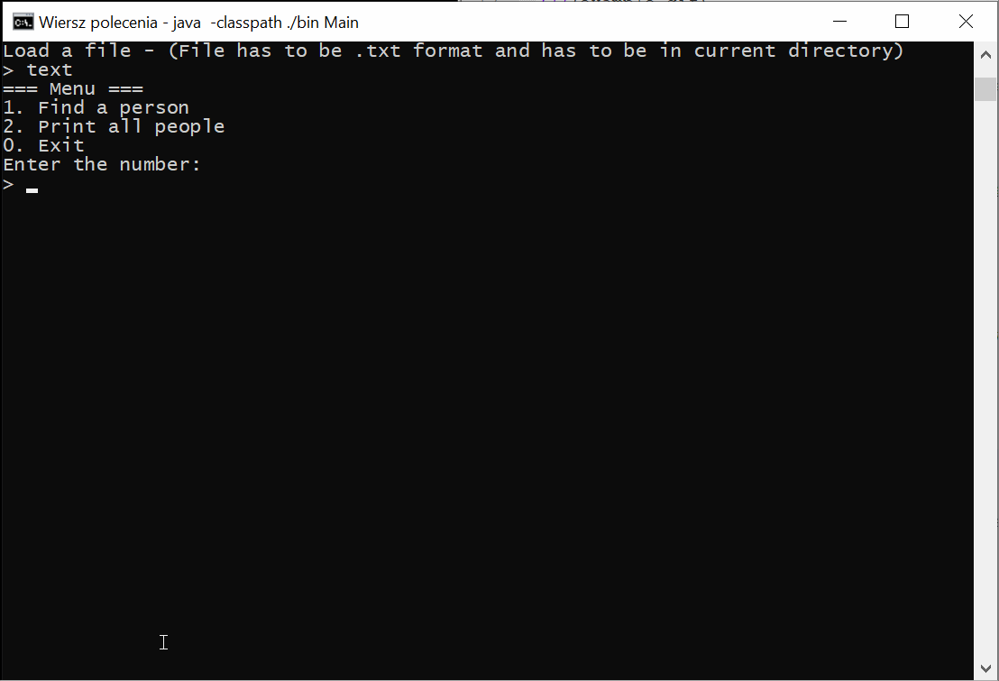

# Simple Search Engine

Search Engine is a simple project using inverted index for optimized search process

In this project strategy pattern was used to easily switch between ALL, ANY and NONE search modes:
ALL - program prints lines containing all word from the query
ANY - program prints lines containing at least one word from the query
NONE - program prints lines that do not contain words from the query at all

# Example



## Running

Java application requires JDK 11 on your machine.

**1. Clone the application**

```bash
git clone https://github.com/Bartosz-Rogala/Simple-Search-Engine
cd simple-search-engine
```

**2. Compile**

```bash
javac -sourcepath ./src -d bin src/Main.java
```

**2. Run**

```bash
java -classpath ./bin Main
```
